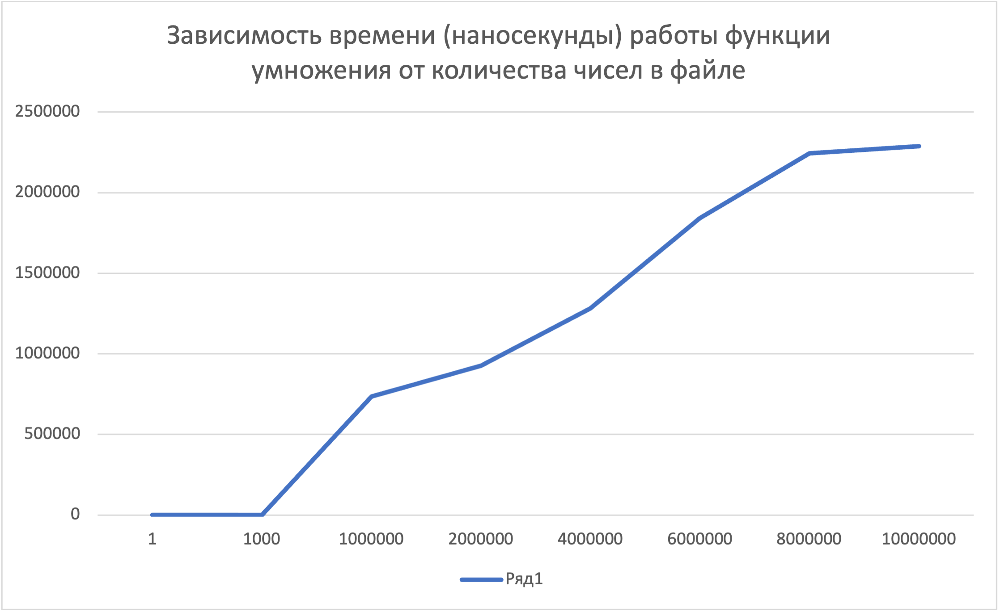

# Описание

В программе sumoperation.java выполняет четыре основные операции с числами, считанными из файла: вычисление минимума, максимума, суммы и произведения. Она включает пять функций:

    getList(): Преобразует содержимое файла в список чисел.
    _min(): Вычисляет минимальное значение.
    _max(): Определяет максимальное значение.
    _sum(): Суммирует все числа.
    _mult(): Умножает все числа.

Программа test.java содержит девять тестов: четыре проверяют корректность работы функций, четыре измеряют время выполнения операций, и один тест проверяет сумму максимума и минимиму.
# Запуск тестов

Тесты запускаются автоматически при каждом коммите. Чтобы запустить тесты вручную, перейдите в раздел Actions на GitHub и выберите Java CI with Maven. Нажмите Run workflow для запуска всех тестов. О состоянии выполнения будет уведомлено в соответствующем разделе.
# График зависимости для функции _mult

График ниже иллюстрирует зависимость времени выполнения функции _mult от количества чисел в файле. 

